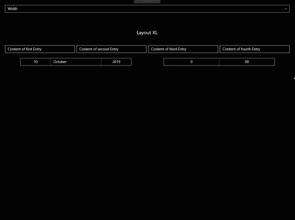
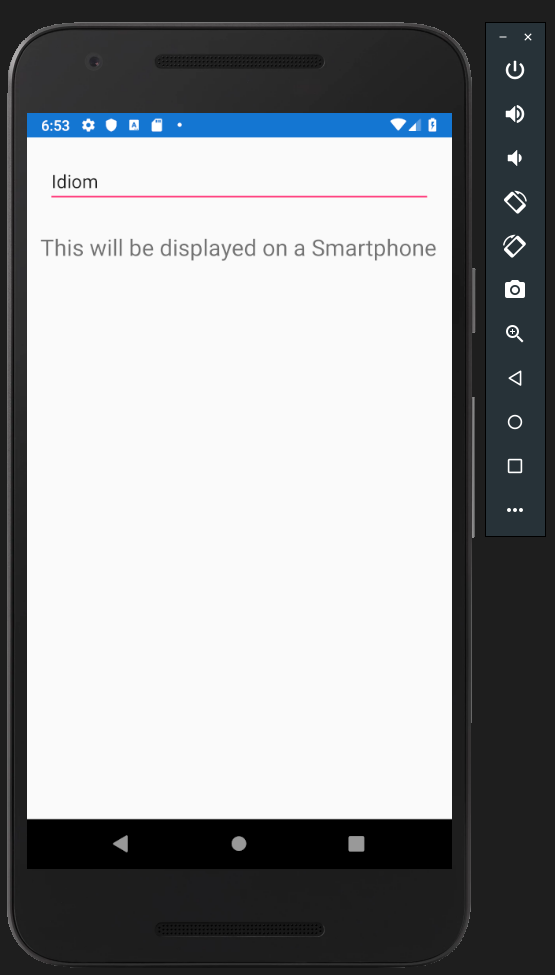
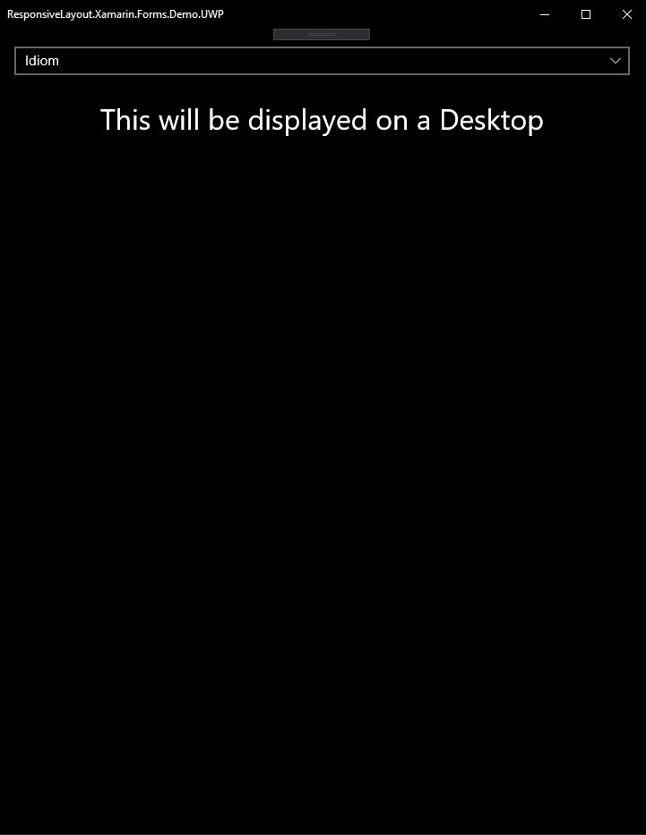

# **ResponsiveLayout**
A responsive LayoutView for Xamarin.Forms where you can define multiple layout templates for different widths, platforms or device types (Idioms).

Tested on Android and UWP. iOS might also work.

## NuGet Installation

https://www.nuget.org/packages/ResponsiveLayout.Xamarin.Forms

    Install-Package ResponsiveLayout.Xamarin.Forms

## Properties

### **EnableContentCaching**: bool

If this option is enabled, the **ResponsiveLayout** will cache the created contents for each requested template.
This is especially useful if you use the LayoutMode "Width" on a desktop application.

### **LayoutMode**: ResponsiveLayoutMode

Determines which DataTemplates will be used.

Available values are: **[Width](#LayoutMode:&nbsp;Width)**, **[Idiom](#LayoutMode:&nbsp;Idiom)**, **[Platform](#LayoutMode:&nbsp;Platform)** and **[Orientation](#LayoutMode:&nbsp;Orientation)**.

---

**Here are some examples:**

# LayoutMode: Width

The **ResponsiveLayout** will choose one of the given templates depending on the width of the main page.
You don't have to sepcify a template for every size (XS - XL), the **ResponsiveLayout** takes the next appropriate template.

## Templates
- **ContentTemplateXS** - Width < 576px
- **ContentTemplateSM** - Width >= 576px
- **ContentTemplateMD** - Width >= 768px
- **ContentTemplateLG** - Width >= 992px
- **ContentTemplateXL** - Width >= 1200px

# LayoutMode: Idiom

The **ResponsiveLayout** takes the template for the current Device Idiom.
If you don't have a specific template for an Idiom, the **ResponsiveLayout** uses the default template.

## Templates
- **ContentTemplateIdiomDefault** - The default template for this mode.
- **ContentTemplateIdiomPhone** - TargetIdiom:Phone
- **ContentTemplateIdiomTablet** - TargetIdiom:Tablet
- **ContentTemplateIdiomDesktop** - TargetIdiom:Desktop
- **ContentTemplateIdiomTV** - TargetIdiom:TV
- **ContentTemplateIdiomWatch** - TargetIdiom:Watch

# LayoutMode: Platform

The **ResponsiveLayout** uses the appropriate template for the current RuntimePlatform.
If you don't have a specific template for a Platform, the **ResponsiveLayout** uses the default template.

## Templates
- **ContentTemplatePlatformDefault** - The default template for this mode.
- **ContentTemplatePlatformIOS** - Device.iOS
- **ContentTemplatePlatformAndroid** - Device.Android
- **ContentTemplatePlatformUWP** - Device.UWP
- **ContentTemplatePlatformMacOS** - Device.MacOS
- **ContentTemplatePlatformGTK** - Device.GTK
- **ContentTemplatePlatformTizen** - Device.Tizen
- **ContentTemplatePlatformWPF** - Device.WPF

# LayoutMode: Orientation

The **ResponsiveLayout** uses the appropriate template for the current device orientation.

## Templates
- **ContentTemplatePortrait** - Height > Width
- **ContentTemplateLandscape** - Width > Height

